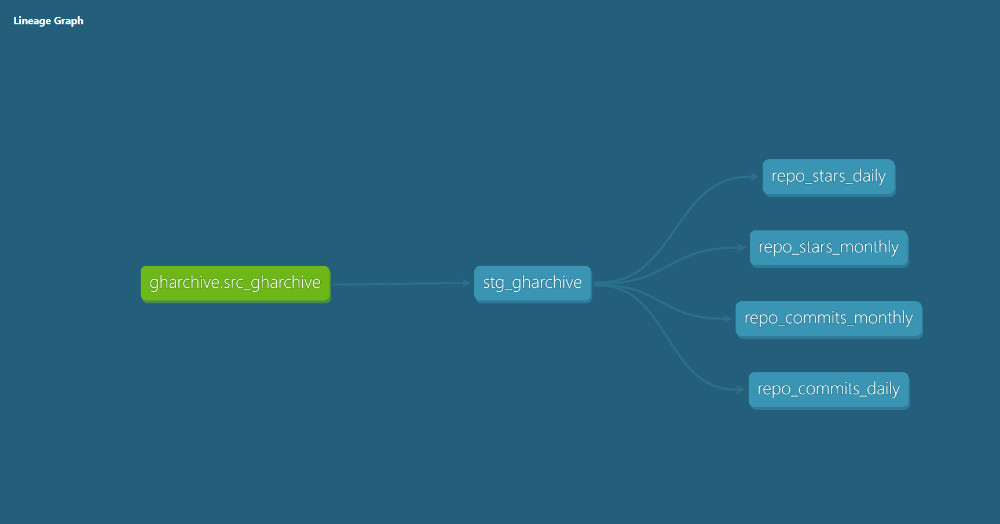

# GitHub Gems: Driving Open-Source Investments With Data

## Overview
GitHub Gems is a data pipeline designed to track and surface trending open-source projects based on key engagement metrics. It provides insights on project popularity and activity, helping developers, data scientists, and investors make informed decisions.

## Key Features
- **Star Growth**: Track the daily and weekly growth of stars to measure popularity.
- **Commit Frequency**: Analyze the rate of commits to assess development activity.
- **Top Contributors**: Identify the key contributors to the most active repositories.
- **Issue Resolution Time**: Monitor how fast issues are being resolved.
- **Contributor Count**: Measure the total number of contributors over time.

## Data Format & Update Frequency
- **Data Format**: CSV and JSON formats.
- **Update Frequency**: Updated daily for real-time insights.

## dbt Lineage Diagram


## Cummulative Stars per Month Chart


```bash
